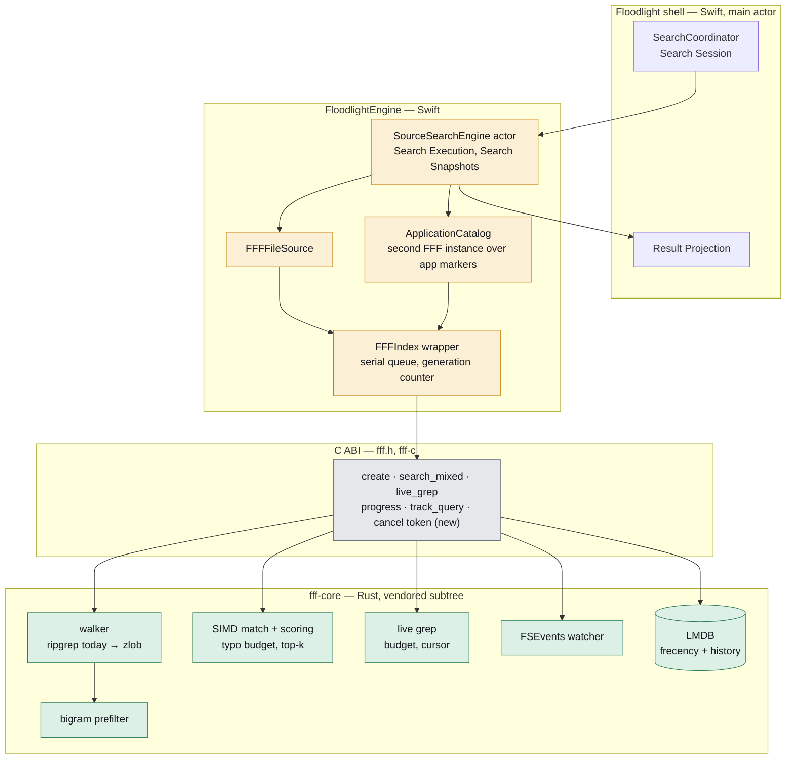
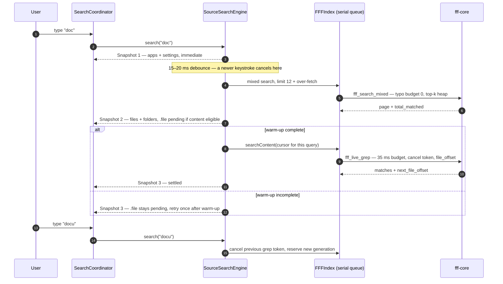
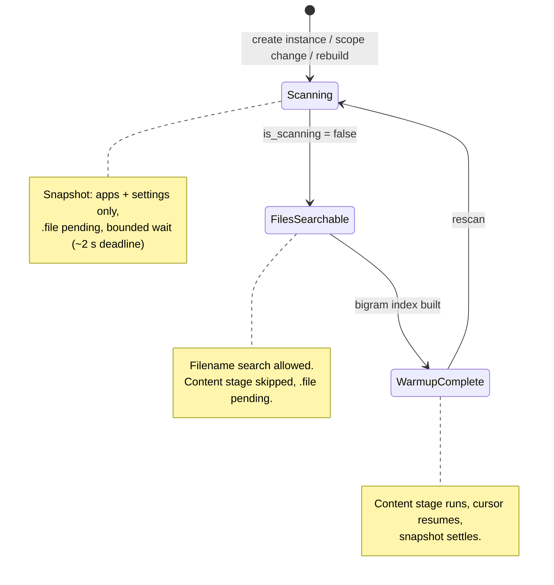
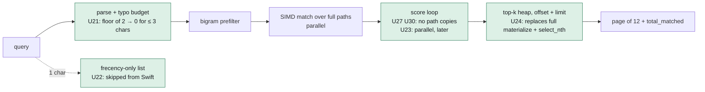
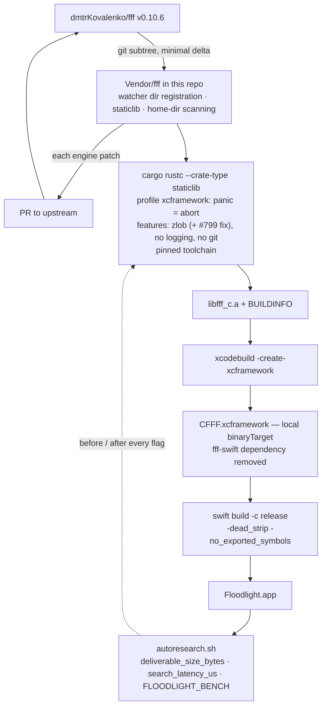
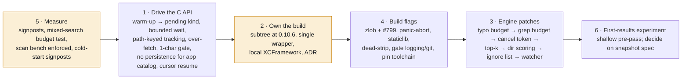

> **Audit summary and evidence:** https://claude.ai/code/artifact/78813a01-4bda-4558-a5ca-6254afc80656
> Full report, Mac checklist, research prompts, and findings index: `.scratch/optimization/` on branch `claude/optimization-opportunities-ca1e6d` (audit commit `936926b`). Finding IDs in brackets (U1, F144, …) point into that report; each carries evidence at `path:line`, a Mac verification recipe, and two reviewer verdicts. Findings U60 to U88 were not adversarially reviewed and are treated as hypotheses to measure.

## The picture

### Where the layers sit

Amber: Layer 1, drive the C API correctly from Swift. Grey: Layer 2, own the boundary and the build. Green: Layer 3, patch the engine and send it upstream. Layers 4 (build flags) and 5 (measurement) wrap the whole stack.

### One keystroke, after the change

### Readiness of the file Search Source

### The query pipeline inside fff-core, with the patches

### Owning the build

### Cold start, today and target

```mermaid
gantt
  title Seconds after process launch, home-directory scope
  dateFormat X
  axisFormat %S
  section Today
  hotkey + panel            :t1, 0, 1
  apps + settings ready     :t2, 0, 1
  full walk (all file results blocked) :crit, t3, 0, 8
  bigram build (content grep unprefiltered) :t4, 8, 12
  section Target
  hotkey + panel            :a1, 0, 1
  apps + settings ready     :a2, 0, 1
  shallow pre-pass, first file results :active, a3, 0, 2
  full walk, zlob, ignore list, no per-file LMDB txn :a4, 0, 6
  bigram build, cancellable, gated content stage :a5, 6, 9
```

The durations are illustrative; the Mac checklist replaces them with signpost numbers.

### Phases and gates

Every arrow is a gate: a phase lands with its before and after numbers in the pull request.

## Problem Statement

I maintain Floodlight, a keyboard-first Spotlight replacement. Its file search runs on the FFF engine, a Rust library that reaches Swift through a C interface and a third-party wrapper package. Today, from where I sit:

- After I log in or relaunch, file results do not exist until the whole home directory has been walked, and the panel shows a spinner for every kind of result while that happens, even though app and settings results are ready.
- Right after launch, content search either burns its whole budget and shows "no matches", or runs with no prefilter at all, because the engine's warm-up state is never read.
- Typing one or two characters feels slower than typing five. The engine scores essentially the whole index for short queries, materializes every match, and then throws almost all of it away.
- A content search for a query that matches nothing can run with no time bound, and a stale one cannot be cancelled, so it queues in front of my next keystroke.
- The engine is built with the slower of its two directory walkers, not the walker every upstream release ships and tests with.
- Every engine or build-flag change I want to try is blocked behind a release of a third-party package, and the wrapper I actually use is a diverged private copy of that package's wrapper. The vendored engine carries a modification that changes nothing in production but makes every future merge harder.
- The engine watcher, as modified in this fork, can hold the index write lock for hundreds of milliseconds during a `git clone` or an Xcode build, freezing the result list, and can force full home-directory rescans that upstream never triggers.
- Nothing measures what the engine actually costs on my real home directory. Every performance argument is made from reading source.

I want the Swift side and the Rust side to be one codebase I can reason about, build, measure, and change end to end, and I want to send the engine improvements back upstream.

## Solution

Bring the engine under Floodlight's own roof and fix how it is driven, in five layers that build on each other:

1. **Drive the C API correctly from Swift.** Read the engine's warm-up flag and express it as pending result kinds; bound the startup wait; key selection tracking with the same query the search used; over-fetch so bundle filtering never starves a page; skip file search for one-character queries; stop opening persistence the application catalog never uses; resume content search from the engine's own cursor instead of restarting at file zero.
2. **Own the engine build.** Vendor the engine source into this repository as a subtree at upstream 0.10.6, keep Floodlight's own thin Swift wrapper as the only wrapper, build the static XCFramework from a script in this repository, and drop the third-party package dependency. Record the decision as an ADR.
3. **Patch the engine where Floodlight's workload needs it, and send each patch upstream.** A bounded grep budget, a cancel token, a zero-floored typo budget, top-k result selection, cheaper directory scoring, a broader macOS ignore list, watcher fixes, and the correctness fixes the audit found.
4. **Build it right.** The upstream walker, a panic-abort profile, dead-strip linking, gated logging and git support, a pinned toolchain with provenance, and a symbolicated profile for Instruments.
5. **Measure it on the real workload.** Signposts around every engine call, a budgeted mixed-search test at Floodlight's query shape, an enforced index-scan benchmark, and cold-start instrumentation.

The Search Session, Result Projection, and every Search Snapshot contract in ADR-0001 stay exactly as they are. The engine gets faster and more honest; the shell learns nothing new about FFF.

## User Stories

Using the terms from `CONTEXT.md`: Search Source, Source Search, Search Execution, Search Snapshot, Search Scope, Degraded Search.

### Launch and warm-up

1. As a user who has just logged in, I want app and settings results to appear as soon as I type, so that a slow home-directory walk never blocks the results that are already ready.
2. As a user typing during the first minute after launch, I want the file kind to read as "still searching" rather than "no matches" until the content index exists, so that I am not told my file does not exist when the engine simply is not ready.
3. As a user typing during warm-up, I want the content stage skipped until the engine reports warm-up complete, so that no keystroke burns a full grep budget scanning an unprefiltered index.
4. As a user on a churning home directory, I want the startup wait to have a deadline, so that a rescan storm can never leave the file Search Source waiting forever.
5. As a user who changes the Search Scope, I want the new scope to become searchable without a guaranteed idle delay, so that scope changes and rebuilds feel immediate.
6. As a user who presses Rebuild Index, I want search to keep answering from the previous index until the new one is committed, so that a rebuild never empties my results.
7. As a user with a large home directory, I want the first file results to arrive after a shallow pre-pass over the folders I use most, so that a launcher is usable seconds before the full walk finishes.

### Per-keystroke search

8. As a user typing a one-character query, I want file search skipped and app and settings results shown, so that the engine does not score the entire index to return query-independent noise.
9. As a user typing two to seven characters, I want the engine to require most of my characters to match, so that short queries stop matching essentially the whole index and every downstream stage stays small.
10. As a user asking for twelve results, I want the engine to keep only the top candidates as it scores, so that it never materializes and partitions hundreds of thousands of matches for a page of twelve.
11. As a user typing quickly, I want a content search that matched nothing to stop at its time budget, so that a zero-match query cannot run unbounded and delay my next keystroke.
12. As a user typing quickly, I want a stale content search cancelled when I type the next character, so that it does not queue in front of the search for the query I actually want.
13. As a user searching a large scope, I want a later stage for the same query to resume content search where the budget cut it off, so that the budget bounds each slice rather than capping how much of my index is ever searched.
14. As a user searching for a file inside an application bundle, I want a full page of non-bundle results, so that Swift-side filtering never returns fewer rows than I asked for or triggers a spurious content search.
15. As a user who repeatedly picks the same file for a path-shaped query, I want the engine's repeat-selection boost to apply, so that selection learning works for path queries and not only for bare names.
16. As a user who opens the same files often, I want file and folder selections to feed the existing recency and frequency store, so that ranking learns from what I open without a new engine surface.
17. As a user, I want directory scoring to cost a fraction of what it costs today, so that mixed file-and-folder queries stop paying for a full-path copy per candidate.
18. As a user, I want the engine to skip highlight-offset computation on paths nothing can display, so that no per-result work is done for output the C interface cannot carry.

### Watcher and index freshness

19. As a user running `git clone`, `npm install`, or an Xcode build inside the Search Scope, I want searches to keep answering while the watcher registers thousands of new directories, so that the result list never freezes behind the index write lock.
20. As a user whose tools create empty directories constantly, I want directory-only watcher events to take no exclusive lock when nothing changed, so that background churn does not spike keystroke latency.
21. As a user with deep directory trees, I want ancestor registration to reuse existing directory entries and to have its own overflow budget, so that the fork's ancestor tracking never forces a premature full rescan.
22. As a user, I want a failed ancestor insert to degrade gracefully, so that a single capacity miss does not orphan directory entries and force a rescan.
23. As a user whose dotfile directories are excluded from the initial walk, I want the watcher to exclude them too, so that writes under `~/.cache` and friends do not overflow the watcher and trigger repeated rescans.
24. As a user, I want a bigram index build to be cancellable, so that quitting the app or changing the Search Scope does not wait for a home-directory content index to finish.
25. As a user editing a file that has grown past two megabytes, I want the watcher to cap its read, so that one growing log file cannot hold the index lock for an unbounded time.

### What gets indexed

26. As a developer with Xcode, I want `~/Library/Developer` and photo and music library bundles excluded by default, so that DerivedData and device support files do not dominate walk time, memory, and watcher traffic.
27. As a user with iCloud Drive or Dropbox, I want `Library/CloudStorage` and `Library/Mobile Documents` to stay indexed, so that my Desktop and Documents remain searchable when they are cloud-backed symlinks.
28. As a user, I want the engine to skip re-reading files it already knows are binary, so that the seconds after the index goes live are not spent re-confirming flags it already has.

### Correctness found on the way

29. As a user, I want a binary or empty file never to hide the rest of its chunk from the content index, so that a stray `return` cannot silently drop 255 files from content search.
30. As a user typing a multi-word query whose first word is one character, I want filename bonuses scored against the word that actually matched, so that ranking is correct for queries like `a doc`.
31. As a user, I want the application catalog's engine instance to open no frecency or history database, so that a corrupt database it never reads cannot stop application search from starting.

### Building and owning the engine

32. As the maintainer, I want the engine source vendored in this repository and the XCFramework built by a script here, so that a flag or engine change lands in one pull request instead of waiting for a third-party release.
33. As the maintainer, I want exactly one Swift wrapper around the C interface, so that I stop hand-porting changes between a private copy and a package I do not import.
34. As the maintainer, I want the vendored engine at upstream 0.10.6 with the no-op `include_binary_files` modification collapsed, so that the remaining vendor delta is small, ABI-neutral, and merges cleanly forever.
35. As the maintainer, I want the XCFramework built with the walker upstream ships and tests with, together with the 0.10.6 non-UTF-8 filename fix, so that the initial walk skips a stat and an allocation per file without regressing on external volumes.
36. As the maintainer, I want the engine built with panic-abort, as a static library only, with dead-stripping and no exported symbols on the app, so that unreachable engine code and unused dependencies leave the deliverable.
37. As the maintainer, I want logging and git support compiled out of the shipped engine, so that a subscriber stack and a vendored libgit2 nobody calls stop shipping in the app.
38. As the maintainer, I want the build to pin an exact toolchain and emit provenance into the artifact, so that two builds weeks apart are attributable when their sizes differ.
39. As the maintainer, I want a one-flag symbolicated profile of the engine, so that Instruments shows Rust function names instead of raw addresses.
40. As the maintainer, I want CI to build and test both walker feature sets, so that the half of the engine Floodlight ships never rots untested.
41. As the maintainer, I want each engine patch shaped as an upstream pull request, so that the vendored delta shrinks over time instead of growing.

### Measuring

42. As the maintainer, I want a signpost around every engine call that separates queue wait from engine time, so that "the engine is slow" becomes a named interval on the real workload.
43. As the maintainer, I want a budgeted mixed-search test at Floodlight's query shape (twelve results, one to four characters, a home-shaped tree) that prints a `FLOODLIGHT_BENCH` line, so that every engine change above is regression-guarded in CI.
44. As the maintainer, I want the index-scan benchmark to run and assert a bound, so that the one major hot path with no enforced budget gets one.
45. As the maintainer, I want cold-start signposts from process launch to hotkey, to panel, to first searchable result, so that the launch work above is measurable.
46. As the maintainer, I want every claimed magnitude in this spec replaced by a measured number before its change is kept, so that unreviewed estimates never become folklore.

## Implementation Decisions

### Layer 1: driving the C API from Swift

- **Warm-up becomes a pending kind, not an exposed flag.** The wrapper's progress value gains the engine's warm-up-complete bit. `SourceSearchEngine` consults it inside the content stage's own serialized call, not from a cached poller, because rescans reset it. While warm-up is incomplete, the content stage is skipped, `.file` stays in the Search Snapshot's pending kinds, and the stage is retried once for the current query after the flag flips. This keeps ADR-0001's rule that a Search Snapshot exposes no raw FFF values. [U4, U55, U81]
- **The startup wait is bounded and no longer double-polls.** The scan wait becomes "poll while scanning, with a deadline near two seconds and a log line on expiry". The application catalog's own iteration-counted wait is replaced by the same helper. The engine's blocking wait call is not used, because it would block the serial queue for the whole scan. Readiness is not decoupled from scan completion; the reviewers showed that produces an empty-results flash where today there is a spinner. [U39, U75]
- **Manual rebuild rescans instead of restarting the engine**, so search keeps serving the old snapshot until commit; a hard restart remains available for watcher recovery, either as a fallback or as a separate "Reset index" action. [U12]
- **Selection tracking uses the path-translated, trimmed query**, the same key the search used, and the scope-prefix guard compares against the root path plus a separator. [U8]
- **Mixed search over-fetches by a small constant** and the Swift side truncates after bundle filtering; no engine ignore-glob API is added for this. [U7]
- **One-character queries skip the file Search Source.** App and settings pages already cover that keystroke; the engine's frecency-only fallback list is query-independent. This is a product behavior change and is documented as such. [U22]
- **File and folder selections feed the existing recent-items store**, and file items receive the same boost applications already do. No new engine access-tracking call is added in this spec. [U5]
- **The application catalog's engine instance opens no persistence.** The wrapper gains an option to run without frecency and history databases; the catalog's dead tracking path is deleted. [U11]
- **Content search resumes from the engine cursor.** The wrapper returns the cursor and totals with each content page; `SourceSearchEngine` keeps the cursor keyed by the current Search Execution and passes it to a follow-up slice for the same normalized query, discarding it when the query changes. Cursor stability across index mutation is an open research question that must be answered before this ships. [U85, U1]
- **Constants that are already correct get comments, not changes**: the small page size that keeps the partial sort engaged, and `max_matches_per_file = 1` as an early exit. [U20]
- **Thread count for fuzzy search is measured before it is changed.** No P-core cap ships on the audit's evidence alone. [U6, U62]

### Layer 2: owning the engine build

- **The engine source moves into this repository** as a git subtree of `dmtrKovalenko/fff` at v0.10.6, carrying only Floodlight's watcher directory-registration change, the static-library crate type, and the `enableHomeDirectoryScanning` option. The `include_binary_files` modification and its ABI version bump are removed (or, if upstream accepts it, merged upstream and re-imported). [U82, U84]
- **Floodlight's own Swift wrapper is the single wrapper.** The third-party wrapper package dependency is removed; the C module is consumed through a local binary target. The test that still imports the third-party wrapper is ported. ADR-0001 already anticipated removing that dependency. [U66, U80, U88]
- **A build script in this repository produces the XCFramework**, with the walker feature, profile, and target set explicitly, and the artifact committed (or referenced through LFS) alongside a provenance file. [U66, U73]
- **A new ADR records this decision** ("Own the FFF engine build"), stating that Floodlight vendors and builds its engine, keeps a minimal upstreamable delta, and treats each engine change as an upstream pull request first.

### Layer 3: engine patches, each shaped for upstream

- **Grep time budget applies unconditionally**; the implicit "at least two matches first" bypass is replaced by an explicit, default-zero option so upstream can keep its behavior. [U1]
- **A cancel token crosses the C interface**: create, cancel, free, and a cancellable grep entry point that threads the existing abort signal. The wrapper cancels the previous token when it reserves a new search generation. [U2]
- **Typo budget is zero-floored and monotone** for the file and directory search paths and for highlight-offset computation, with the minimal variant (never a budget at or above the needle length) as the lower-risk first step. [U21]
- **Result selection is top-k**: a bounded heap keyed by total score, modification time, and original index, applied to file and directory pagination, sequential first; parallelizing the scoring loop is a later, separately measured step. [U24, U23, U37]
- **Directory scoring stops copying paths**: the dirname length is derived from stored offsets, the frecency-only directory path is parallelized, and the mixed search uses an offset-plus-limit internal page per side. [U27, U26, U36]
- **Highlight offsets are skipped** for every consumer of the C interface through an additive no-highlights entry point; no options field and no ABI change. [U25]
- **Repeat-selection boost hoists loop-invariant work** and adds a last-byte reject before any string materialization. [U30]
- **Ignore list gains `Library/Developer`, photo and music library bundles, and a short list of `~/Library` subtrees**, and explicitly keeps `CloudStorage` and `Mobile Documents`. No FFI knob for extra patterns; a user-facing "exclude folder" setting, if ever wanted, is a Swift-side path filter. [U47, U48]
- **Binary sniffing skips extension-flagged binaries and stops at the first NUL**; no truncation, no parallelization. [U40]
- **Watcher fixes**: dedupe ancestors outside the write lock and add a hashed overflow directory index; restore an early return for directory-only events that changed nothing; skip ancestors that already resolve and give directories their own overflow reserve; make ancestor insertion best-effort; apply the walker's hidden-component rule in the watcher; cap the modify-path read at the indexable size and re-check the binary flag. [U76, U77, U78, U79, U45, U35]
- **Bigram build is cancellable** through the existing cancellation signal; no I/O budget or frecency reordering, which the reviewers showed breaks the sort invariant the index depends on. [U44]
- **Frecency lookups during the walk short-circuit on an empty database** and otherwise share one read transaction per chunk. [U41]
- **Correctness fixes**: `continue` instead of `return` in the bigram builder; the filename bonus uses the filtered needle; the fallback re-match thread formula derives from work size. [U54, U34, U28]
- **Old index drops happen after the lock is released**, at both the rescan commit and the restart path that scope changes hit. [U46]

### Layer 4: build flags and toolchain

- **The zlob walker ships**, in the same commit as the backported 0.10.6 non-UTF-8 basename fix and the pinned zlob version; CI installs Zig and runs both feature sets. [U57, U58, U86]
- **A dedicated XCFramework profile** inherits release and sets panic-abort; the shared release profile is untouched. [U60]
- **The engine is built as a static library only**, per invocation, without editing the crate manifest. [U69]
- **The app links with dead-strip and no exported symbols**, and the gain is confirmed with a link-map diff before it is kept. [U61]
- **Tracing is capped at warn at compile time first; the subscriber stack and vendored git are gated behind default-on features and built out**, with size attribution measured before the larger git refactor is undertaken. [U65, U64]
- **mimalloc becomes the engine's global allocator only after the symbol-collision check passes**; it is a hard gate. [U63]
- **Toolchain is pinned and provenance emitted**; flags reach cargo through the environment rather than relying on config-file discovery from the package root. [U73, U59, U68]
- **A profiling profile is selectable** from the build script for symbolicated traces. [U70]

### Layer 5: measurement

- **Signposts wrap every wrapper entry point**, one interval spanning queue wait plus call, one inner interval for the call alone. [U71]
- **A budgeted mixed-search test** at Floodlight's shape emits a bench line and is harvested by the existing release-config gate; a Rust-side criterion bench seeded with a query tracker lives in the engine's own bench directory if wanted. [U38]
- **The index-scan benchmark asserts a bound** and can point at a real directory through an environment variable. [F144, U71]
- **Cold-start signposts** cover launch to hotkey, to panel, to first searchable result. [F61]

### Sequencing and gates

Phases in order: measurement (Layer 5) and Layer 1 items that need no engine change; then Layer 2 (own the build) since every later layer depends on it; then Layer 4 flags one at a time with a size and latency number each; then Layer 3 engine patches in the order typo budget, grep budget, cancel token, top-k, directory scoring, ignore list, watcher fixes; then the shallow pre-pass experiment for first file results. The on-disk index snapshot is designed only after the pre-pass is measured. [U42, U43]

Every change respects the existing gates: no synchronous disk read on the query path, no full sort on the search path, no UI framework in the engine target, no force unwrap, warnings as errors, strict concurrency. None of the decisions above contradict ADR-0001 or ADR-0007; the warm-up decision is shaped specifically to honor ADR-0001's snapshot contract.

## Testing Decisions

A good test here exercises external behavior through a production seam and never asserts on an engine internal: what a Search Snapshot contains and when, what the wrapper returns for a given tree, and what a hot path costs in release configuration.

- **`SourceSearching` / `SourceSearchEngine` (highest seam).** With a scripted file Search Source: the content stage is skipped and `.file` stays pending while warm-up is incomplete, then runs once after it completes; a stale content stage never publishes after a newer query; the startup wait expires at its deadline and the Search Execution continues in a Degraded Search state; a one-character query never calls the file source; a rebuild keeps serving the previous candidates until the new ones commit. Prior art: the existing engine orchestration tests and the coordinator tests that substitute a scripted Source Search adapter.
- **Wrapper and engine boundary.** Over a temporary tree: a page never shrinks below the requested limit when bundle internals match; tracking a path query three times ranks the selection first; a scope containing an invalid-UTF-8 filename on a non-APFS volume renders lossily instead of panicking; the content cursor continues without skipping or repeating files across two slices; the catalog instance starts with no persistence files present. Prior art: the existing wrapper tests, including the seeded folder-move watcher coherence cases.
- **Release-config performance gate.** New budgeted tests following the ranking performance test's pattern (warm up, many samples, median, hard bound, bench line): mixed search at limit twelve for one to four character queries on a home-shaped synthetic tree; the index-scan benchmark with an asserted bound; time to first file result with the shallow pre-pass. Prior art: the existing search and ranking performance suites and the release performance script.
- **Rust engine tests and benches.** In the vendored workspace: unit tests for the typo budget table, the top-k heap's tie-break semantics against a full sort, the bigram builder's `continue`, the filename-bonus needle, the cancel token aborting within one chunk, the watcher early return and ancestor deduplication, the binary-sniff skip, and the ignore-list entries; criterion benches for search scalability, result limits, thread scaling, grep, and a new directory group. Prior art: the engine's existing integration tests for rescan regression, directory index consistency, and watcher lifecycle, and its existing criterion benches.
- **Build verification.** A link-map diff before and after each flag; a symbol check that the static library exports no allocator symbols; a provenance file present and stable across two clean builds; both walker feature sets passing in CI.
- **End-to-end on a Mac.** The Mac checklist in `mac-todo.md` under the upstream sections provides the commands; each layer lands with its before and after numbers recorded in the pull request.

## Out of Scope

- Clipboard history, rich text, result-row presentation, and every Floodlight-side finding outside the engine integration (the F-series in the audit).
- Profile-guided optimization of the engine, a universal arm64 plus x86_64 XCFramework, cross-module optimization of the engine target, and the P-core thread cap: each is an experiment gated on a measurement, not a commitment. [U72, U67, U74, U6, U62]
- Incremental narrowing across keystrokes; it is speculative until the typo budget lands and the matcher's monotonicity is confirmed. [U32]
- The full hot/cold split of the engine's per-file record and the flat path-store redesign; only the small pointer-shrink is in scope. [U31, U56]
- The on-disk index snapshot format. This spec includes the shallow pre-pass experiment and the measurement that decides whether persistence is worth its own spec. [U42, U43]
- A "recent searches" empty state and file or folder chip totals; both are product features, not engine work. [U19, U14]
- Reducing the engine's C result struct allocations; refuted as unmeasurable and ABI-unsafe as proposed. [U16]

## Further Notes

- The maintainer framed this as a project for fun and for learning how Rust and Swift meet, more than as urgent optimization. The spec is ordered so that each layer teaches something concrete: how the C interface is called, how the static library is built and linked, how the engine's search pipeline is shaped, and how to prove a change with a bench. It is fine to stop after any layer.
- Findings U60 to U88 carry no reviewer verdict. Their proposals are included because their code citations were re-verified, but every one of them must produce a number on a Mac before it is kept.
- Research prompts that unblock specific items are in `research-prompts.md` under the upstream sections: content-cursor stability across index mutation, the matcher's exact typo semantics, whether the default target-cpu already implies the SIMD features, and mimalloc in a static library consumed by Swift.
- Each engine patch should be opened as a pull request against `dmtrKovalenko/fff` at the same time it lands in the vendored copy, so that the delta shrinks with every upstream release instead of growing.
- The audit's own limitation applies to this spec: it was produced on a machine that cannot build Swift or Rust, from reading source at commit `936926b` and the upstream checkouts. Baselines first.
