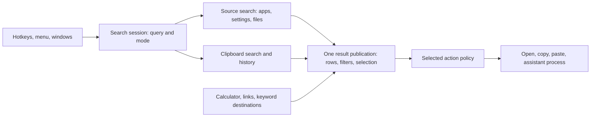

# Floodlight: architectural ablation study

Date: 2026-09-13. Source baseline: `ae665ca2`, with existing local artifacts preserved.

Floodlight's strongest simplification opportunity is overlapping application retrieval, rather than its main ownership seams.
The engine, result publication, clipboard module, and action performer each hide meaningful behavior.
Removing those owners would mostly redistribute their responsibilities.

## Bird's-eye model

Floodlight is a keyboard-driven intent router with local retrieval and operating-system actions.
Its features share interaction mechanics, but have different storage and execution needs.



The package split separates engine code from the macOS shell.
The conceptual split is finer: intent, acquisition, publication, execution, and durable state.
Those responsibilities matter more than the number of files or protocols.

`SearchCoordinator` owns interaction intent; `SourceSearchEngine` owns asynchronous source work.
`SearchResultProjection` returns rows, filters, selection, and progress together.
`SelectedResultActionPerformer` coordinates effects after explicit activation.
Clipboard history and assistant execution introduce distinct lifecycles beneath those shared interactions.

Evidence: [package definition](../Package.swift), [session](../Sources/Floodlight/Search/SearchCoordinator.swift),
[source execution](../Sources/FloodlightEngine/Search/SourceSearchEngine.swift),
[publication](../Sources/Floodlight/Search/SearchResultProjection.swift),
[actions](../Sources/Floodlight/Search/SelectedResultActionPerformer.swift).

## Method and limits

An ablation removes one capability or substitutes a simpler implementation, then observes the difference.
This study combines three evidence levels:

1. Compare real application retrieval with and without its indexed contribution.
2. Substitute deterministic sources behind the production engine and compare ranking implementations.
3. Apply the deletion test to remaining modules using source contracts and existing tests.

Only the first two levels are executed ablations.
Contract tests passing do not prove that an unimplemented replacement would pass.
No shipping implementation was removed or changed.

The application experiment uses synthetic application discovery with the real FFF marker index and temporary storage.
It does not measure installed-app recall, long-term learning, startup savings, battery use, or real desktop interaction.
The broader review covers the main runtime architecture, rather than exhaustive verification of every helper.
Build, release, documentation, and mechanical tooling were inspected through their entry points, without ablation experiments.

## Measured: remove the secondary application index

`ApplicationCatalog` already discovers applications and matches their names in memory.
Its indexed path retrieves marker files, maps them back to applications, then applies the same Floodlight scorer.
Both paths add `RecentStore` boosts.

The experiment compared their deduplicated union against immediate-only retrieval.
It used 46 applications and 20 queries covering prefixes, acronyms, transpositions, Unicode normalization, broad matches, and misses.

| Measurement | Result |
| --- | --- |
| Real indexed results across all queries | 31 |
| Queries with changed application top 12 | 0 of 20 |
| Additional candidates beyond immediate top 12 | 6 |
| Indexed candidates missing from immediate top 80 | 0 |

The six additional candidates all appeared for `studio`.
Therefore, deleting the indexed pass unchanged would shrink the lower-ranked result set in this fixture.
The shell can publish up to 80 rows, so unchanged top 12 does not establish identical visible behavior.

**Recommendation: prototype one application retrieval path with an explicit candidate budget.**
Keep discovery, refresh, blocklisting, name scoring, and recent-use learning.
Evaluate removing marker files, marker mappings, the secondary index, scan waits, rescans, and its learning route.
Retain the main FFF file index.

Before production removal, compare full publications, counts, exclusions, learned ordering, and install/remove/rename behavior.
Measure cold startup, refresh cost, storage, and per-query latency on a realistic application corpus.
Increasing the candidate budget changes behavior and workload; it requires an explicit decision.

Evidence: [catalog implementation](../Sources/FloodlightEngine/Search/ApplicationCatalog.swift),
[reproducible experiment](../Tests/FloodlightEngineTests/ArchitectureAblationTests.swift),
[raw results](../.scratch/architectural-ablation/application-index.log).

## Measured: substitute full sorting for bounded ranking

Both algorithms consumed identical `SearchItem` arrays and the same comparator.
The replacement was `sorted(by: ranksBefore).prefix(12)`.
The production heap and replacement returned identical rows for all three fixture sizes.

The optimized standalone harness alternated algorithm order across 25 rounds, with ten calls per sample.
It discarded five warm-up rounds and reported the upper median of the remaining twenty samples.

| Candidates | Heap, microseconds | Full sort, microseconds | Sort / heap |
| --- | ---: | ---: | ---: |
| 12 | 4.38 | 4.46 | 1.02× |
| 1,500 | 91.18 | 2,216.44 | 24.31× |
| 15,000 | 587.58 | 30,552.48 | 52.00× |

**Recommendation: keep bounded ranking.**
Its implementation complexity buys measurable performance while preserving a small interface.
These are local synthetic measurements, not whole-application latency claims.
The 15,000-candidate case is a stress fixture, not a claim about typical application counts.

Evidence: [production ranking](../Sources/FloodlightEngine/Search/Catalog.swift),
[harness](../.scratch/architectural-ablation/Study.swift),
[measurements](../.scratch/architectural-ablation/results.txt).

## Measured: remove source contributions and intermediate publications

The production engine ran against deterministic adapters containing five distinct candidates.
Each variant changed one contribution, except the explicit file-failure scenario.

| Variant | Settled candidates | Interpretation |
| --- | ---: | --- |
| Baseline | 5 | Immediate applications/settings, indexed applications/files, and content |
| No indexed application contribution | 4 | The engine supports additional indexed candidates |
| No settings | 4 | Settings are an additive source |
| No content contribution | 4 | Filename search cannot supply content-only matches |
| No file contributions | 3 | Application and settings behavior survives |
| File retrieval fails; content empty | 3, degraded | Healthy catalog results survive failure |
| Consumer accepts settled snapshots only | 5 | Final candidates survive; intermediate visibility disappears |

These fixtures establish separability and result consequences, rather than realistic recall or timing.
The empty-content variant still executes the content stage and its delay.
The settled-only variant filters consumption; it does not remove engine work or measure resource savings.

The stream uses `bufferingNewest(1)`.
An initial harness incorrectly required all three snapshots to reach its consumer and intermittently trapped.
The corrected harness checks final results and permits intermediate snapshots to be coalesced.
This was a harness assumption failure, not evidence of a production regression.

Evidence: [harness and assertions](../.scratch/architectural-ablation/Study.swift),
[source buffering and execution](../Sources/FloodlightEngine/Search/SourceSearchEngine.swift).

## Architectural deletion test across the remaining runtime

The following judgments are source-grounded recommendations, not executed replacement experiments.

| Proposed removal or replacement | What disappears or moves elsewhere | Judgment |
| --- | --- | --- |
| Merge engine and shell | Compile-time separation and independent engine tests | Keep the existing two-module split |
| Inline source execution into the session | Cancellation, startup, scope mutation, degradation, provenance move into UI orchestration | Keep the source owner |
| Publish rows, filters, and selection separately | Callers must coordinate selection continuity and coherent updates | Keep atomic publication |
| Collapse clipboard capture/search/store into the coordinator | Persistence, classification, payload restoration, preview state, and retention spread into interaction code | Keep clipboard ownership |
| Replace clipboard SQLite with a memory ring | Restart persistence and indexed history search disappear | Only consider with deliberate product scope reduction |
| Replace action policy with direct OS calls in views | Success-gated dismissal, learning, activation, and paste ordering spread across views | Keep the action performer and effects seam |
| Replace automatic paste with copy-and-dismiss | Accessibility, target restoration, and synthesized-keystroke lifecycle become unnecessary | Valid product simplification; loses one-key paste |
| Remove the assistant feature | Process discovery, output handling, cancellation, timeout, and answer state disappear | Optional capability to evaluate using actual usage |
| Inline assistant lifecycle into the session | Replacement and stale-completion logic return to the coordinator | Keep its owner while the capability exists |
| Remove caches or decode during rendering | Repeated reads, decoding, directory resolution, and invalidation become caller responsibilities | Keep workload-specific caching; avoid speculative generic cache layers |
| Remove presentation coordination | Configuration exclusivity, reentrancy, and restoration rules spread across hotkey/menu/window paths | Keep one presentation owner |
| Remove catalog refresh coordination | Discovery walks can overlap or repeat unnecessarily | Keep shared refresh guard and fingerprints |

Evidence includes [clipboard ownership](adr/0008-clipboard-search.md),
[committed scope](adr/0007-committed-search-scope.md),
[paste delivery](../Sources/Floodlight/App/PasteTargetDelivery.swift),
[assistant runner](../Sources/FloodlightEngine/Search/AssistantProcessRunner.swift),
[presentation owner](../Sources/Floodlight/App/ApplicationPresentationCoordinator.swift),
[path resolution cache](../Sources/Floodlight/Search/PathResolutionCache.swift),
and [image cache](../Sources/Floodlight/UI/ClipboardImageCache.swift).

The main simplification principle is one owner per changing fact.
Additional product capabilities should plug into intent, publication, or execution without becoming universal source abstractions.
Clipboard and assistant lifecycles do not fit the file-source contract merely because they share a panel.

## Priorities

1. Prototype removing the secondary application index, with a deliberate result-budget policy.
2. Measure usage before deciding whether assistant execution, content search, or automatic paste merits its product cost.
3. Preserve the owners of asynchronous execution, coherent publication, clipboard state, and action ordering.
4. Avoid low-return protocol pruning or generic frameworks while the larger retrieval duplication remains unresolved.

No usage evidence was collected, so this study does not recommend deleting a feature based on presumed popularity.

## Verification and reproduction

Verification completed:

- 33 tests passed across source execution, ranking, and assistant-session suites.
- 139 tests passed across eight selected shell contract suites.
- The real application-index experiment passed and returned nonempty indexed results.
- The added test passed focused SwiftFormat lint.
- The standalone harness compiled with optimization and checked each final candidate set.

Raw logs live under [the experiment directory](../.scratch/architectural-ablation/).
The test and report are new deliverables; production sources remain unchanged.
Full `make check`, the full test suite, packaging, and live desktop QA were not run.

From the repository root:

```sh
swift test --filter ArchitectureAblationTests
swift test --filter 'SourceSearchEngineTests|SearchItemRankingTests|AssistantRunSessionTests'
swift test --filter 'SearchCoordinatorIntegrationTests|SearchCoordinatorPathNavigationTests|SelectedResultActionPerformerTests|PasteTargetDeliveryTests|ApplicationPresentationCoordinatorTests|ClipboardSearchTests|ClipboardImageCacheTests'
swiftc -O -g -parse-as-library -package-name Floodlight \
  Sources/FloodlightEngine/Models/SearchItem.swift \
  Sources/FloodlightEngine/Search/FFFModels.swift \
  Sources/FloodlightEngine/Search/Catalog.swift \
  Sources/FloodlightEngine/Search/SourceSearchEngine.swift \
  Sources/FloodlightEngine/Utilities/FloodlightPerformance.swift \
  .scratch/architectural-ablation/Study.swift \
  -o /tmp/floodlight-ablation-study
/tmp/floodlight-ablation-study
```
